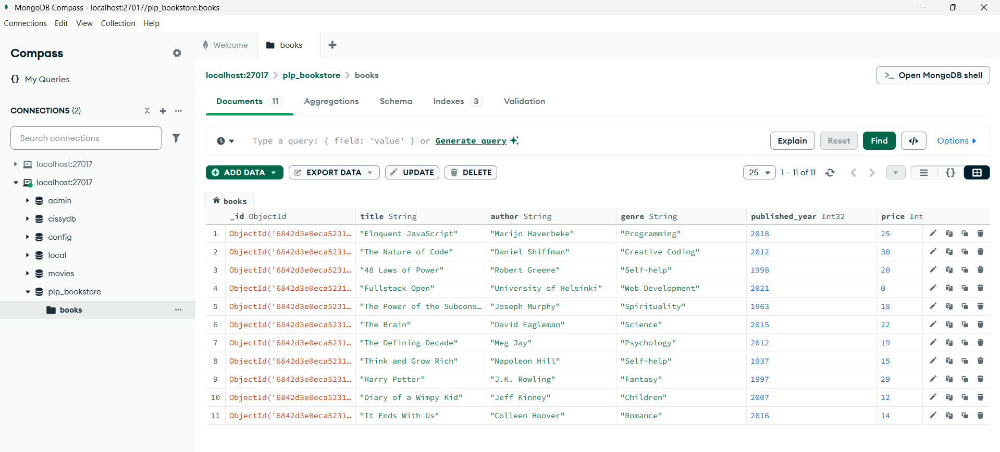
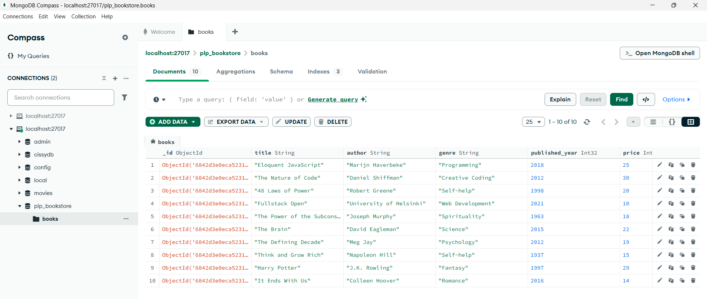
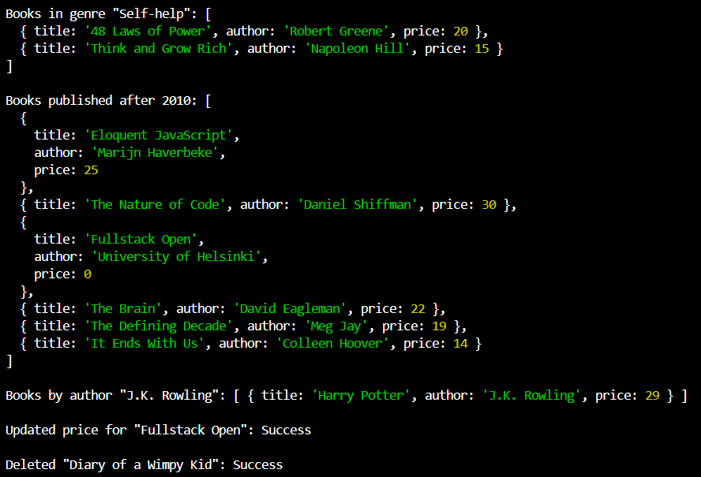
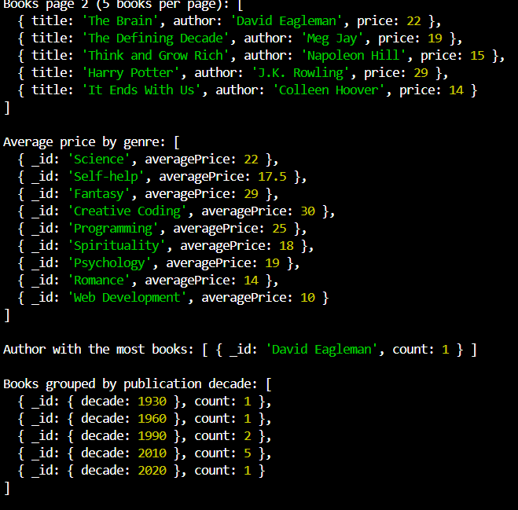

# 📚 MongoDB Fundamentals Assignment - Book Collection

This project demonstrates core MongoDB concepts using Node.js. It covers data insertion, CRUD queries, advanced filtering, aggregation pipelines, and indexing — all applied on a sample collection of books.

---

## 🛠️ Tech Stack

- Node.js  
- MongoDB (local installation or MongoDB Atlas)  
- Native MongoDB Driver for Node.js  

---

## 📁 Project Structure

week-1-mongodb-fundamentals-assignment-cissybosibori/
├── insert_books.js # Script to insert initial book data
├── queries.js # MongoDB queries: CRUD, advanced queries, indexing
├── README.md # This documentation file
├── package.json # Project dependencies and scripts
├── node_modules/ # Installed Node.js modules
└── screenshots/ # Sample screenshots (MongoDB Compass views, query results)

---

## ⚙️ Setup & Usage Instructions

1. **Clone the repository**  
   ```bash
   git clone <your-repo-url>
   cd week-1-mongodb-fundamentals-assignment-cissybosibori


## Install dependencies
npm install

## Insert sample books into MongoDB
Make sure MongoDB is running (locally or via Atlas).
Then run
node insert_books.js

## Run the queries script
node queries.js

View the data and queries output
Open MongoDB Compass or Atlas and connect to your database to visually inspect the collections and results.

📸 Sample Screenshots
### Books Collection in MongoDB Compass  



### Sample Query Output  




✅ Features Implemented
Inserted 12 sample books with fields: title, author, genre, published_year, price, in_stock

Basic queries: find books by genre, author, publication year

Update and delete operations on specific books

Advanced queries using projection (title, author, price), sorting, pagination

Aggregation pipelines for average price by genre, author with most books, books grouped by decade

Indexes created on title and compound index on author + published_year fields

Query performance analyzed with explain() method

📬 Author
Silvya Bosibori
MongoDB Fundamentals Assignment | 2025

